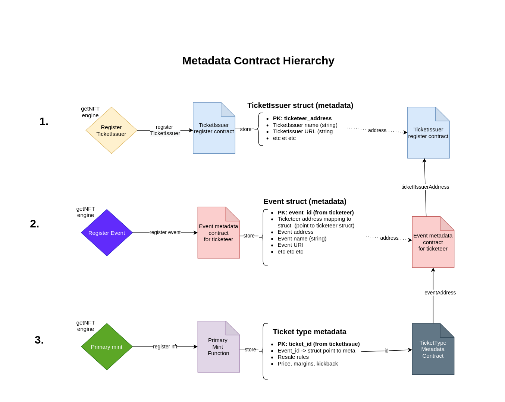

# GET Protocol - Metadata Specification - getNFT 

---

| variable name            | type    | description of metadata                                                   | mutable |         Set by        |
|--------------------------|---------|---------------------------------------------------------------------------|---------|:---------------------:|
| nftIndex                 | uint    | Unique identifier of the getNFT in the contract. Assigned by factory.     |    no   |  NFT Factory Contract |
| _setnftMetadata          | string  | String reference to database twin of getNFT. Passed on by ticket issuer.  |   once  |      primaryMint      |
| _markTicketIssuerAddress | address | Address of the ticketissuer of the getNFT.                                |   once  |      primaryMint      |
| _markEventAddress        | addres  | Address of the event the getNFT belongs to.                               |   once  |      primaryMint      |
| _setnftScannedBool       | bool    | Boolean value. false = unscanned. true = scanned                          |   once  | primaryMint, scanNFT  |

---

## 1. getNFT Flexible Metadata Contracts 
The NFT factory has 2 storage contracts that handle the metadata storage and structure. In order to facilitate changes to the metadata structure the contract allows for the admin to change the metadata storage contracts by setting `address public event_metadata_TE_address;` and `address public ticket_metadata_address`.

### 1-A. getNFT ticketIssuer Metadata
Consumer purchase their tickets from a webshop or platform. The types of data passed per ticketIssuer integrator might vary, the table below shows several options of the data that can be passed. 

| variable              | description                                                                      |   type  | required |
|-----------------------|----------------------------------------------------------------------------------|:-------:|:--------:|
| tickeer_address       | Public key hash of the ticketIssuer.                                                | address |    yes   |
| ticketissuer_name        | Commercial name of the ticketing company / integrator / business.                |  string |    no    |
| ticketissuer_shop_url    | Website of the ticketissuers ticket shop / platform (where NFT can be traded)       |  string |    no    |
| ticketissuer_support_url | Website of the ticketissuers support department for questions about the NFT/ticket. |  string |    no    |
| listPointerT          | internal value used to store data this data type in a smart contract efficiently |   uint  |    yes   |
| tickeer_id            | Internal unique identifier of the ticketissuer                                      |   uint  |    yes   |

The `tickeer_address` is the only required field. 

### 1-B. getEvent Metadata

Storage struct name: `Eventstruct`.

| variable          | description                                                    | type    | required |
|-------------------|---------------------------------------------------------------|---------|----------|
| event_address     | Public key hash of the event.                                 | address |    yes   |
| event_name        | Event slug/name describing the event.                         |  string |    no    |
| organizer_name    | Slug name of the organizer (or identifier)                    |  string |    no    |
| event_shop_url    | URL pointing to the primary/secondary/general shop of event.  |  string |    no    |
| location_cord     | Coordinates of the location of the event.                     |  string |    no    |
| date_time_gmt     | Date/time the event is scheduled to take place on.            |   uint  |    yes   |
| ticketissuer_address | Address of the ticketissuer/issuer that is servicing the event.  | address |    yes   |
| TicketIssuerStruct   | Pointer to the storage struct with ticketissuer metadat.         | mapping |     -    |

The unique identifier of the event metadata struct is the `event_address`. This public key hash is set by the getNFT custody. Similar to the ticketissuer metadata, editing of previously submitted data is only possible by overriding (but using the same primary key - which is always an `address`).

### 1-C. getEvent Orders Metadata 
The GET Protocol indentifies 2 different types of orders. `OrdersPrimary` and `OrdersSecondary`. These structs store/register data about 

Example metadata contract storage:
<pre><code>
    struct OrdersPrimary {
        uint256 _nftIndex;
        uint256 _pricePaid;
    }

    struct OrdersSecondary {
        uint256 _nftIndex;
        uint256 _pricePaid;
    }    

    struct TicketIssuerStruct {
        address ticketissuer_address;
        string ticketissuer_name;
        string ticketissuer_url;
        uint256 listPointerT;
    }

    struct EventStruct {
        address event_address;
        string event_name;
        string shop_url;
        string latitude;
        string longitude;
        uint256 start_time;
        address ticketissuer_address;
        uint256 amountNFTs;
        uint256 grossRevenuePrimary;
        uint256 grossRevenueSecondary;
        string callback_url;
        TicketIssuerStruct ticketIssuerMetaData;
        mapping (uint256 => OrdersPrimary) ordersprimary;
        mapping (uint256 => OrdersSecondary) orderssecondary;
        uint256 listPointerE;
    }
</code></pre>

The `EventStruct` has a nested reference to the `TicketIssuerStruct`. This means that when referring to a `EventStruct` a link to the issuer (ticketissuers) metadata is included. 

There are 2 Order structs `OrdersPrimary` and `OrdersSecondary`. 

---

## Storing & Updating Metadata

**1. TicketIssuer MetaData**
Basic information about the ticketissuer that has issued the ticket. It is the ticketissuer that is reponsible for passing on the instructions. The primary key of the ticketissuer is their ticketissuerAddress. This is a rather static address meaning that it rarely if ever changes. 

Function: newTicketIssuer stores data of the ticketissuer in the contract. The primary key of the struct is the publickeyhash of the ticketissuer (ticketissuerAddress).

<pre><code>
    function newTicketIssuer(address ticketissuerAddress, string memory ticketissuerName, string memory ticketissuerUrl) public onlyRelayer returns(bool success)
</code></pre>

Variables TicketIssuer (subject to change/discussion):
- ticketissuerAddress
- ticketissuerName
- ticketissuerUrl 

**2. Event Metadata**

<pre><code>
  function newEvent(address eventAddress, string memory eventName, string memory shopUrl, string memory coordinates, uint256 startingTime, address tickeerAddress) public onlyRelayer returns(bool success)
</code></pre>

**2. Ticket Metadata**

#### 4-B. Reading Metadata 

**1. getEventDataAll**
Fetches all the metadata of both the event & ticketissuer struct. 

<pre><code>
    getEventDataAll(address eventAddress) public view returns(string memory eventName, string memory shopUrl, string memory locationCord, uint startTime, string memory ticketissuerName, address, string memory ticketissuerUrl)
</code></pre>

**2. getEventDataAll**

